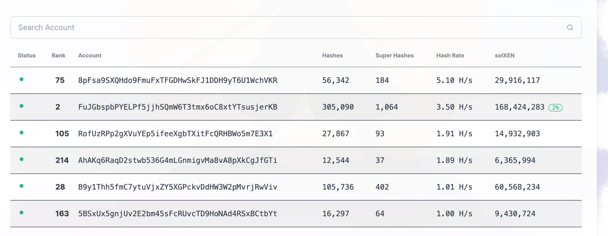
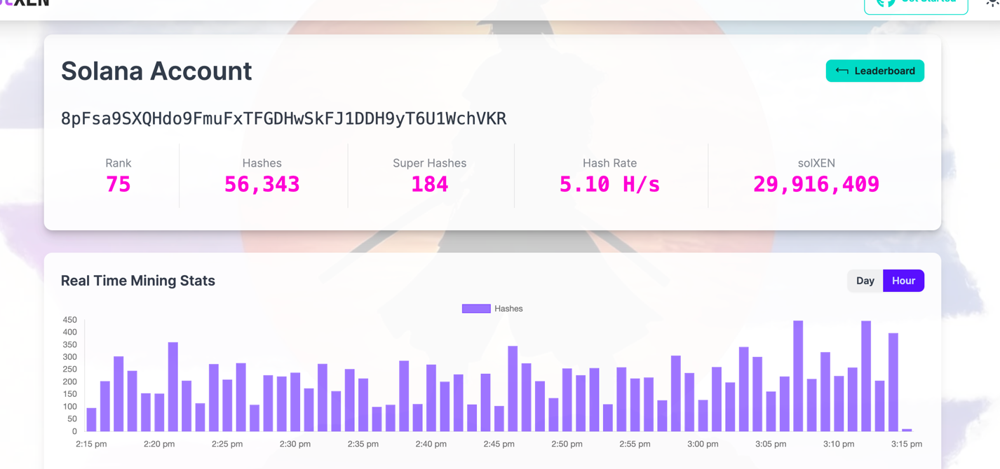

# solXen mint工具 [solXen Mint Tool]

## 重要 改动支持了jito bundle。单线程就可以基本跑满。
### 安装 （需要golang v1.21.0 以上版本）

```shell
git clone https://github.com/wangchengao/solxen-tx-jito-bundles.git
make all

// 之后修改solana-tx.yaml 设置sol下的 EnableJitoBundles: true 

./solxen-tx miner
```

### 如果直接下载

https://github.com/wangchengao/solxen-tx-jito-bundles/releases

Windows (x64):
```shell
solxen-tx-windows-amd64.zip
```

Linux (x64):
```shell
solxen-tx-linux-amd64.tar.gz
```

Linux (arm64):
```shell
solxen-tx-linux-arm64.tar.gz
```

macOS (x64):
```shell
solxen-tx-darwin-amd64.tar.gz
```

macOS (arm64):
```shell
solxen-tx-darwin-arm64.tar.gz
```

### 性能：
榜单


提交详情


在 5500 tip fee情况下（平均每个tx 1100 优先费）， 轻松hash rate到榜一。

### 特性
1. 去除了多余的 Instruction ， 可以做到 5000 tip fee就能轻松提交tx成功。
2. 对jito bundles 的 多个 api 负载均衡，增加请求qps。

### 如果对你有帮助，可以对我进行打赏
sol address: 3fVhXMEQJLsWQsFcWy9zTgEmyjUutDaYKQT1gEkHNb4y

eth address: 0x5f96ae068a258eb0dd4456ef2eec3c3d89fb064f

--------
## 下面是官方版本的Readme
## 特点 [Features]
```shell
支持多线程并发模式 [Supports multithreaded concurrent mode] done
支持获取优先级费用 [Supports automatic priority fee setting]
支持自动从子钱包转账 [Supports automatic transfer from sub-wallets]
```

## 0. 下载 [Download]

```
https://github.com/mmc-98/solxen-tx/releases
```

Windows (x64):
```shell
solxen-tx-windows-amd64.zip
```

Linux (x64):
```shell
solxen-tx-linux-amd64.tar.gz
```

Linux (arm64):
```shell
solxen-tx-linux-arm64.tar.gz
```

macOS (x64):
```shell
solxen-tx-darwin-amd64.tar.gz
```

macOS (arm64):
```shell
solxen-tx-darwin-arm64.tar.gz
```
 
## 1. 配置 [Configuration]


```shell
# sol配置 [Configuration]
Name: solxen-tx
Sol:
  Url: "https://api.devnet.solana.com"                          # rpc地址 [rpc address]
  Mnemonic: ""                                                  # 助记词 [mnemonic phrase]
  Num: 1                                                        # 并发数 [concurrency]
  Fee: 3000                                                     # 优先级费用 [priority fee]
  Kind: 1                                                       # -1 按照账户分配 kind， -2 随机分配kind（谨慎改成随机, minter的时候要kind改成从0，1，2，3 分四次mint）
  ToAddr: "0x4A7766a5BD50DFAB5665d27eDfA25471b194E204"          # eth空投地址 [eth address for receiving xn airdrop]
  ProgramID: "7LBe4g8Q6hq8Sk1nT8tQUiz2mCHjsoQJbmZ7zCQtutuT"     # solxen合约地址 [solxen contract address]
  Time: 1000                                                    # 间隔时间(单位毫秒) [interval time (milliseconds)]
  HdPAth: m/44'/501'/0'/0'                                      # 钱包地址路径 [wallet derivation path]
  EnableJitoBundles: true                                       # 启用 jito bundle 一次提交五个tx， fee会变为五个tx的bundle fee tip
```
 


## 2. 运行miner [Run Miner]

```shell
./solxen-tx miner
```

## 3. 运行 minter   [Run Minter]
```shell
./solxen-tx minter

 ```


## all cmd
```shell
  ./solxen-tx -h

A cli tool solxen-tx

Usage:
  solxen-tx [command]

Available Commands:
  airdrop     airdrop
  balance     balance
  completion  Generate the autocompletion script for the specified shell
  help        Help about any command
  miner       miner
  minter      minter

Flags:
  -h, --help      help for solxen-tx
  -v, --version   version for solxen-tx


 ```
